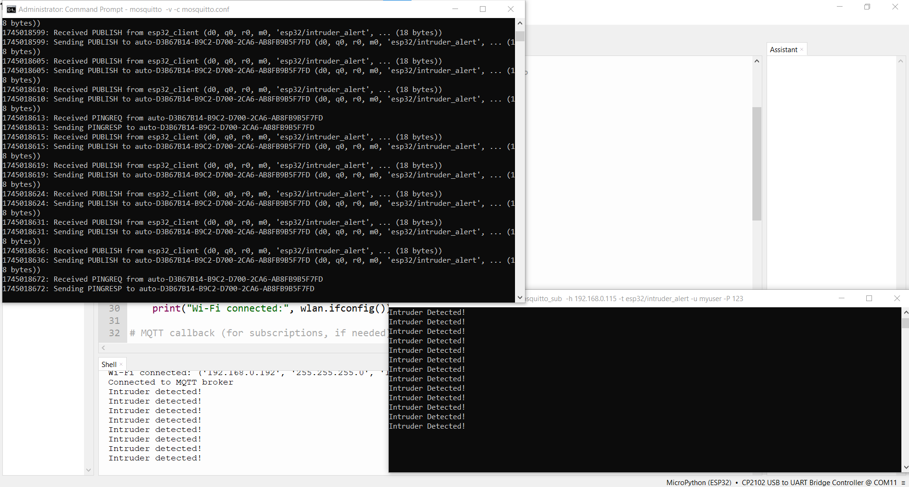
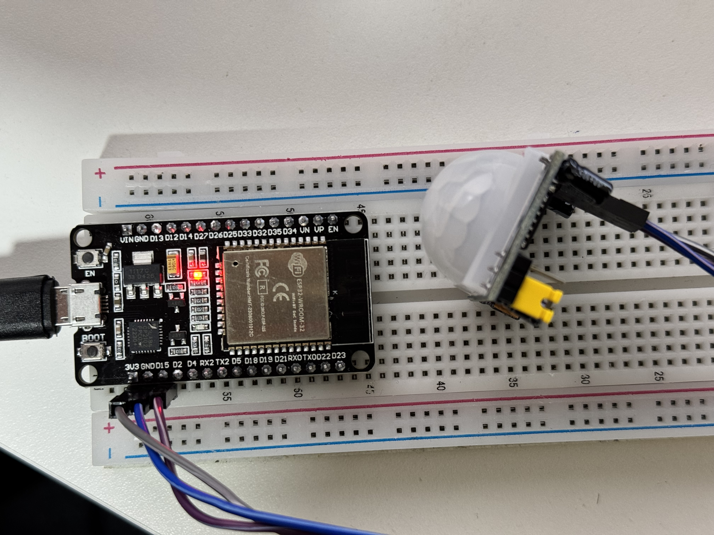

# ESP32 MQTT Intruder Alert

A MicroPython project for ESP32-WROOM that detects motion using a PIR sensor and sends alerts via MQTT to a local Mosquitto broker.

## Hardware
- ESP32-WROOM
- PIR sensor (GPIO 13)
- Windows computer running Mosquitto MQTT broker

## Setup
1. Install Mosquitto on Windows: [Mosquitto Downloads](https://mosquitto.org/download/).
2. Configure `C:\Program Files\mosquitto\mosquitto.conf`:
3. Create password file: `mosquitto_passwd -c "C:\Program Files\mosquitto\passwd" myuser`.
4. Upload `umqtt.simple` to ESP32 (from [micropython-lib](https://github.com/micropython/micropython-lib)).
5. Update `main.py` with your Wi-Fi, broker IP, and credentials.
6. Run Mosquitto: `mosquitto -v -c mosquitto.conf`.
7. Subscribe to `esp32/intruder_alert` using MQTT Explorer or `mosquitto_sub`.

## Testing
- Trigger the PIR sensor to send "Intruder Detected!" messages.
- Monitor messages in MQTT Explorer or command line (`mosquitto_sub -h 192.168.1.100 -t esp32/intruder_alert -u myuser -P mypassword`).

## Screenshots

